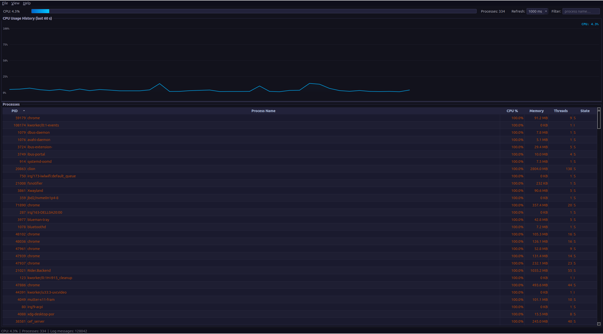

# Linux System Activity Monitor

A real-time desktop application that reads live system data from the Linux `/proc` virtual filesystem and displays it in a Qt 6 graphical interface. Built as a university OOP 2 course project (MSC1052, Spring 2026) to demonstrate every major C++ object-oriented programming concept taught during the semester.

---

## Project Overview

The application shows two views simultaneously:

- **CPU usage history** — a scrolling line graph of the last 60 seconds of CPU activity, updated every second.
- **Process table** — a live list of every running process on the machine, showing PID, name, CPU percentage, memory usage, thread count, and state.

Data is read entirely from the Linux `/proc` virtual filesystem — no external libraries or system-call wrappers are used. The GUI is built with Qt 6 and refreshes on a configurable timer (500 ms / 1 000 ms / 2 000 ms). All file I/O errors are caught with custom exception classes and logged to `monitor.log` without crashing the application.

---

## Repository Overview

```
Linux_monitor/
│
├── CMakeLists.txt              # CMake build configuration (Qt 6, C++17)
├── main.cpp                    # Application entry point — QApplication + MainWindow
│
└── src/
    │
    ├── core/                   # Business logic — reads /proc, holds data
    │   ├── IDataReader.h       # Pure abstract interface for all reader classes
    │   ├── IRenderable.h       # Pure abstract interface — toDisplayString()
    │   ├── MonitorExceptions.h # Custom exception hierarchy (FileReadException, etc.)
    │   ├── SystemInfo.h/.cpp   # Abstract base class — source path + timestamp
    │   ├── CpuInfo.h/.cpp      # Derived: CPU tick counters + usage % calculation
    │   ├── ProcessInfo.h/.cpp  # Derived: one process entry (pid, name, cpu, mem…)
    │   ├── ProcessList.h/.cpp  # Container: vector<ProcessInfo> with sort/filter
    │   ├── CpuReader.h/.cpp    # Reads /proc/stat → fills a CpuInfo snapshot
    │   └── ProcessReader.h/.cpp# Scans /proc/[pid]/ → fills a ProcessList
    │
    ├── utils/                  # Reusable utilities
    │   ├── Logger.h/.cpp       # Singleton logger — writes timestamped lines to monitor.log
    │   ├── Formatter.h         # Function templates (clamp<T>, calculatePercent<T>)
    │   │                       # and overloaded formatValue() for compile-time polymorphism
    │   └── RingBuffer.h        # Class template — fixed-size circular buffer for graph history
    │
    └── gui/                    # Qt 6 graphical interface
        ├── MainWindow.h/.cpp   # QMainWindow — composes all subsystems, drives the 1 s timer
        ├── CpuGraphWidget.h/.cpp   # Custom QWidget — live scrolling CPU graph (QPainter)
        ├── ProcessTableModel.h/.cpp# QAbstractTableModel — bridges ProcessInfo to QTableView
        └── AboutDialog.h/.cpp  # Simple QDialog — application info
```

### Key design relationships

| Relationship | Classes involved |
|---|---|
| Inheritance (abstract base) | `SystemInfo` → `CpuInfo`, `ProcessInfo` |
| Interface implementation | `IDataReader` → `CpuReader`, `ProcessReader` |
| Interface implementation | `IRenderable` → `SystemInfo` (and transitively all derived) |
| Composition (has-a) | `MainWindow` owns `CpuReader`, `ProcessReader`, `ProcessList` |
| Composition (has-a) | `ProcessList` owns `vector<ProcessInfo>` |
| Composition (has-a) | `CpuGraphWidget` owns `RingBuffer<double>` |
| Qt inheritance | `MainWindow` → `QMainWindow`, `CpuGraphWidget` → `QWidget`, `ProcessTableModel` → `QAbstractTableModel`, `AboutDialog` → `QDialog` |

---

## How to Compile and Run

### Prerequisites

```bash
# Ubuntu / Debian
sudo apt install qt6-base-dev cmake g++

# Fedora / RHEL
sudo dnf install qt6-qtbase-devel cmake gcc-c++

# Arch Linux
sudo pacman -S qt6-base cmake gcc
```

Minimum versions required: **Qt 6.2**, **CMake 3.16**, **GCC 11** or **Clang 14** (C++17 required).

### Build

```bash
# Clone or open the project directory
cd Linux_monitor

# Create an out-of-source build directory
mkdir build && cd build

# Configure
cmake .. -DCMAKE_BUILD_TYPE=Release

# Compile (uses all available CPU cores)
make -j$(nproc)
```

The compiled binary is placed at `build/Linux_monitor`.

### Run

```bash
# From inside the build/ directory
./Linux_monitor

# Or with an explicit path from the project root
./build/Linux_monitor
```

A log file named `monitor.log` is created (or appended to) in the working directory where the binary is launched. It records every startup event, timer tick error, and logger message with timestamps.

### CLion

Open the project root in CLion. CLion detects `CMakeLists.txt` automatically. Select the `Linux_monitor` run configuration and press **Run**.

---

## GUI Interface



### Menu bar

| Menu | Item | Action |
|---|---|---|
| File | Quit | Closes the application |
| View | Refresh: 500 ms | Sets the update interval to 0.5 seconds |
| View | Refresh: 1000 ms | Sets the update interval to 1 second (default) |
| View | Refresh: 2000 ms | Sets the update interval to 2 seconds |
| Help | About | Opens the About dialog |

### Top bar

| Control | Description |
|---|---|
| **CPU: X.X%** label | Current CPU usage percentage, updated every tick |
| Progress bar | Visual CPU load bar; turns orange above 50%, red above 80% |
| **Processes: N** | Total number of running processes found in `/proc` |
| **Refresh** combo box | Switches the timer interval between 500 ms, 1 000 ms, and 2 000 ms |
| **Filter** text box | Filters the process table by process name (case-insensitive, live) |

### CPU history graph

- Displays the last **60 data points** (60 seconds at the default interval) as a smooth anti-aliased line.
- The area under the line is filled with a translucent gradient.
- Horizontal dotted grid lines are drawn at 25%, 50%, 75%, and 100%.
- Percentage labels are printed on the left axis.
- The current CPU value is printed in the top-right corner of the graph.
- History is stored in a `RingBuffer<double>` — older readings are automatically overwritten when the buffer is full.

### Process table

- Sorted **descending by CPU usage** by default so the most active processes appear first.
- Clicking any **column header** re-sorts the table by that column (PID ascending, Name ascending, CPU descending, Memory descending).
- Typing in the **Filter** box instantly hides rows whose process name does not match.
- Clicking a **row** prints the full process details in the status bar for 4 seconds.

| Column | Source | Notes |
|---|---|---|
| PID | `/proc/[pid]/status` | Process ID |
| Process Name | `/proc/[pid]/status` → `Name:` | Executable name |
| CPU % | `/proc/[pid]/stat` utime+stime delta vs system delta | Per-process CPU share |
| Memory | `/proc/[pid]/status` → `VmRSS:` | Resident set size — actual RAM in use |
| Threads | `/proc/[pid]/status` → `Threads:` | Number of threads |
| State | `/proc/[pid]/status` → `State:` | R=Running, S=Sleeping, D=Disk wait, Z=Zombie, T=Stopped |

**Color coding:**
- Zombie processes (`Z`) are shown in red.
- Stopped processes (`T`) are shown in yellow.
- Processes using more than 50% CPU are shown in orange.

### Status bar

Updated every tick:

```
CPU: 18.4%  |  Processes: 214  |  Log messages: 432
```

When a row is selected, the status bar temporarily shows the full debug string for that process (PID, name, CPU%, memory, thread count, state), then reverts to the live stats after 4 seconds.

### About dialog

Accessible via **Help → About**. Shows the application name, version, course information, and a brief description. Closed with the **Close** button.
